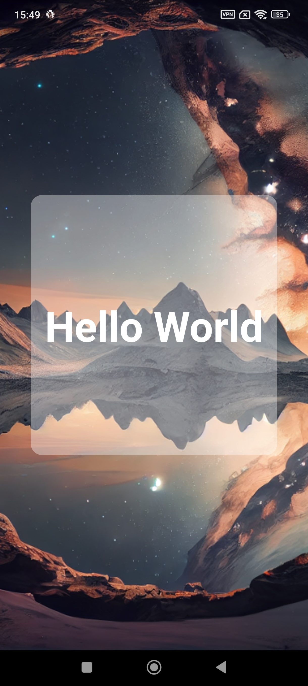

[](https://choosealicense.com/licenses/mit/)
---
# :star: Test_1(Glassmorphism)
React Native Glassmorphism Effect App

# :camera: Screenshots



# :sparkles: Features
- Beautiful glassmorphism effect
- Easy-to-understand code structure
- Responsive design
- Styled text with blur background

# :hammer_and_wrench: Stack used

**Front-end:** React Native, Expo

# :package: Prerequisites
```bash
npx expo install expo-blur
```
    
# :books: Reference
[Expo BlurView](https://docs.expo.dev/versions/latest/sdk/blur-view/)

[Expo Documentation](https://docs.expo.dev/)

# :busts_in_silhouette: Authors
- [@imbiel-dev](https://www.github.com/imbiel-dev)


